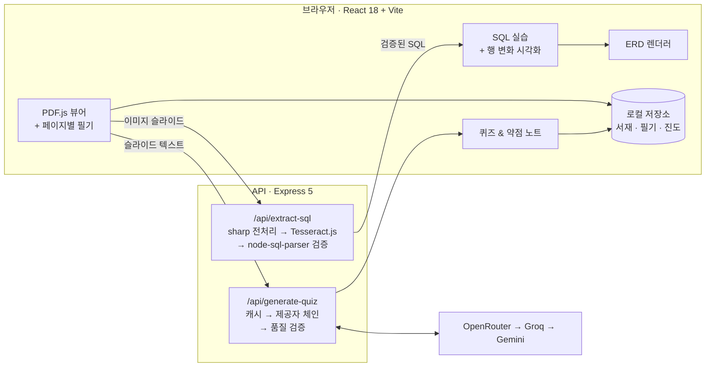

<div align="center">

# QueryNote AI

**데이터베이스 과목을 위한 AI 기반 인터랙티브 학습 노트**
강의자료를 읽고, 슬라이드 속 SQL을 바로 실행하고, 틀린 문제가 다음 복습을 이끄는 — 하나로 이어진 학습 흐름


<sub>제3회 숭실 재학생 학습법 경진대회 출품작 (2026)</sub>

</div>

---

## 📌 문제 정의

영어로 된 데이터베이스 강의자료로 공부하는 과정은 여러 도구로 흩어져 있습니다.

- 모르는 개념이 나오면 → 슬라이드 내용을 AI 챗봇에 **일일이 복사·붙여넣기**
- 설명을 받으면 → 다른 필기 앱에 **다시 옮겨 적기**
- 시험 전 복습할 때는 → 강의자료와 필기를 **번갈아 가며 확인**
- SQL 예제가 **이미지로 삽입**되어 있어 직접 실행해볼 수 없음
- 어떤 개념을 반복해서 틀리는지 **기록이 남지 않음**

**QueryNote AI는 이 흐름을 하나의 작업 공간으로 합쳤습니다.** 읽기, 필기, SQL 실습, 자기 점검이 지금 보고 있는 슬라이드를 중심으로 연결됩니다.

## ✨ 주요 기능

| | 기능 | 설명 |
|---|---|---|
| 📄 | **슬라이드 연동 뷰어** | PDF.js로 강의자료를 원본 그대로 표시합니다. 필기는 페이지별로 저장되고 다시 열면 그대로 복원됩니다. |
| 🔍 | **슬라이드 속 SQL 추출** | PDF 텍스트에서 SQL만 골라냅니다. 이미지로 된 슬라이드는 고해상도로 렌더링해 OCR로 인식한 뒤, SQL 파서로 문법을 검증하고 자동 보정합니다. |
| 🧪 | **인터랙티브 SQL 실습** | DDL·DML·JOIN을 브라우저에서 실행하고 행 단위 변화를 보여줍니다. INSERT는 초록색, UPDATE는 노란색으로 강조되고 DELETE된 행은 사라집니다. 실행 내역은 로그로 남습니다. |
| 🗺️ | **ERD 자동 생성** | `CREATE TABLE`을 실행하면 PK/FK 관계가 담긴 ERD가 바로 그려집니다. 1:1, 1:N, M:N 관계를 코드로 만들며 눈으로 확인할 수 있습니다. |
| 🔁 | **회독 단계별 모드** | 1회독은 자세한 설명 위주(퀴즈 잠금), 2회독은 실습과 퀴즈 개방, 3회독 이상은 압축 설명과 심화 문제를 제공합니다. |
| 🧠 | **LLM 기반 퀴즈 생성** | 현재 슬라이드 내용과 회독 단계에 맞춘 객관식 문제를 생성하고, 즉시 피드백과 관련 페이지 링크를 제공합니다. |
| 📋 | **약점 노트** | 오답과 "다시 설명해줘" 요청이 틀린 횟수, 날짜, 관련 페이지와 함께 자동 기록되어 시험 전 나만의 복습 목록이 됩니다. |
| 📚 | **서재 & 이어서 학습** | 강의자료마다 마지막 페이지, 회독 단계, 필기 수, 약점 개념을 카드로 보여주고, 클릭 한 번으로 이전 상태 그대로 이어서 학습합니다. |

### 지원하는 SQL

- **DDL**: `CREATE TABLE`, `ALTER TABLE`, `DROP TABLE`
- **DML**: `INSERT`, `UPDATE … WHERE`, `DELETE … WHERE`, `SELECT` (`WHERE`, `BETWEEN`, `IN`, `LIKE`, `DISTINCT`, `ORDER BY`, `GROUP BY`, 별칭)
- **JOIN**: `NATURAL`, `INNER`, `CROSS`, `LEFT OUTER`, `RIGHT OUTER`, 셀프 조인
- **제약조건**: `PRIMARY KEY`, `FOREIGN KEY`, `NOT NULL`, `UNIQUE`

## 🏗️ 아키텍처



## 🔧 기술적 특징

**여러 LLM을 이어 쓰는 퀴즈 생성 파이프라인**
퀴즈는 정해진 순서(`OpenRouter → Groq → Gemini`, `QUIZ_PROVIDER`로 변경 가능)대로 LLM 제공자를 시도합니다. 각 응답은 다음 과정을 거칩니다.
1. 깨진 JSON도 최대한 복구해 파싱
2. 형식이 잘못됐거나 주제에서 벗어난 문제는 걸러내고, 정답 번호가 어긋난 문제는 보정하는 품질 검증
3. 통과한 문제가 부족하면 더 짧은 프롬프트로 재시도

모든 제공자가 실패해도 템플릿 기반 생성기가 대신 문제를 만들어 학습 흐름이 끊기지 않습니다. 결과는 슬라이드 내용의 해시값을 키로 캐싱합니다.

**문장이 아닌 코드에 맞춘 OCR**
슬라이드 이미지를 `sharp`로 2.5배 이상 확대하고 흑백 변환·정규화·선명화를 거친 뒤, Tesseract를 희소 텍스트 모드와 SQL용 문자 화이트리스트로 실행합니다. 인식 결과는 문장 후보로 나눠 정규화·자동 보정한 뒤 `node-sql-parser`로 검증하고 점수를 매깁니다. 가장 좋은 후보를 신뢰도 점수·대안 후보와 함께 반환하며, 서버를 쓸 수 없을 때는 브라우저의 Tesseract.js로 대신 처리합니다.

**API 키 없이도 동작**
필기 정리와 SQL 해설은 기기 안에서 생성되고, 퀴즈는 템플릿으로 대체됩니다. API 키가 없어도 핵심 학습 흐름은 그대로 사용할 수 있습니다.

## 🛠 기술 스택

| 분야 | 기술 |
|---|---|
| 프론트엔드 | React 18, Vite 6, PDF.js |
| 백엔드 | Node.js, Express 5, Multer |
| OCR & SQL | Tesseract.js, sharp, node-sql-parser |
| AI | OpenRouter, Groq, Google Gemini |
| 저장 | 브라우저 로컬 저장소 (서재, 필기, 진도) |

## ⚙️ 실행 방법

**필요 환경:** Node.js 18 이상

```bash
git clone https://github.com/sojjeoi/querynote-ai.git
cd querynote-ai
npm install
cp .env.example .env   # LLM API 키 입력 (선택)
npm run dev
```

`npm run dev`를 실행하면 Vite 개발 서버와 API 서버(포트 `5174`)가 함께 시작됩니다. `/api` 요청은 Vite가 API 서버로 자동 전달합니다.

### 환경 변수

| 변수 | 설명 |
|---|---|
| `OPENROUTER_API_KEY` / `OPENROUTER_MODEL` | OpenRouter API 키와 모델 목록 (쉼표로 구분) |
| `GROQ_API_KEY` / `GROQ_MODEL` | Groq API 키와 모델 |
| `GEMINI_API_KEY` / `GEMINI_MODEL` | Google Gemini API 키와 모델 |
| `QUIZ_PROVIDER` | 제공자 시도 순서 (예: `openrouter,groq,gemini`) |
| `OPENROUTER_TIMEOUT_MS` / `OPENROUTER_MAX_TOKENS` | 요청 제한 시간과 최대 토큰 수 |
| `API_PORT` | API 서버 포트 (기본값 `5174`) |

## 📁 폴더 구조

```
querynote-ai/
├── querynote.jsx          # 앱 화면: 서재, PDF 뷰어, SQL·ERD 실습, 퀴즈, 약점 노트
├── src/main.jsx           # 진입점 + 브라우저 저장소 어댑터
├── server.js              # Express API: OCR 기반 SQL 추출, LLM 퀴즈 생성
├── sql-recognition.js     # SQL 블록 추출, OCR 결과 정규화·검증·점수화
├── vite.config.js         # 개발 서버 설정 + /api 프록시
└── .env.example           # 환경 변수 템플릿
```

## 🌿 브랜치 전략

| 브랜치 | 용도 |
|---|---|
| `main` | 제출 및 시연용 안정 버전 |
| `develop` | 기능 개발 및 테스트 |

작업은 `develop`에서 먼저 진행하고, 시연 가능한 상태가 되면 `main`으로 병합합니다.
