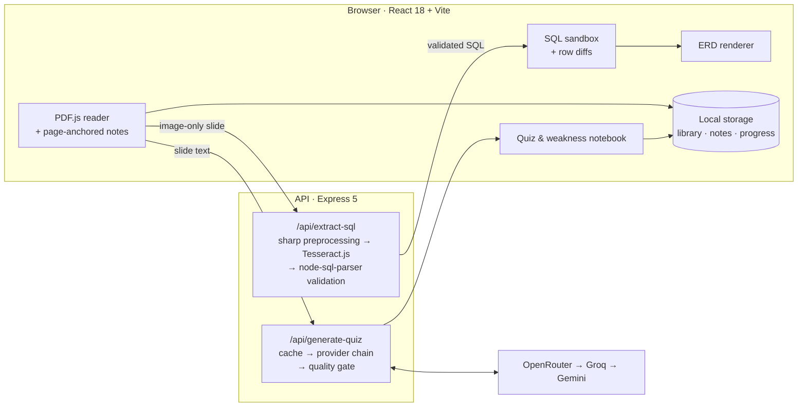

<div align="center">

# QueryNote AI

**An AI-powered interactive study notebook for database courses.**
Read lecture slides, run the SQL inside them, and let your mistakes shape what you review next — all in one flow.


<sub>Built for the 3rd Soongsil University Student Learning Method Competition (2026)</sub>

</div>

---

## The Problem

Studying databases from English lecture slides is fragmented:

- Hit an unfamiliar concept → **copy-paste** the slide into a chatbot.
- Get an explanation → **re-write it** into a separate note app.
- Review before the exam → **juggle** the slides and the notes side by side.
- SQL examples are **embedded as images**, so you can't actually run them.
- There's **no record** of which concepts you keep getting wrong.

**QueryNote AI collapses that workflow into a single workspace** where reading, note-taking, hands-on SQL practice, and self-assessment are connected to the exact slide you're on.

## Features

| | Feature | What it does |
|---|---|---|
| 📄 | **Slide-anchored reader** | Renders lecture PDFs with PDF.js. Notes are pinned to each page and restored when you return. |
| 🔍 | **SQL extraction from slides** | Pulls SQL out of the PDF text layer. For image-only slides, it renders the page at high resolution and runs an OCR pipeline, then validates and auto-repairs the result with a SQL parser. |
| 🧪 | **Interactive SQL sandbox** | Executes DDL, DML, and JOINs in the browser with row-level diffs: inserts in green, updates in yellow, deletes removed. Every run is recorded in an execution log. |
| 🗺️ | **Live ERD generation** | `CREATE TABLE` statements instantly become an ERD with PK/FK relationships, so 1:1, 1:N, and M:N mappings can be built and seen in code. |
| 🔁 | **Reading-pass modes** | 1st pass: detailed explanations, quizzes locked. 2nd pass: practice and quizzes unlocked. 3rd+ pass: condensed explanations and advanced questions. |
| 🧠 | **LLM-generated quizzes** | Multiple-choice questions generated from the current slide and tuned to your reading pass, with instant feedback and links back to the source page. |
| 📋 | **Weakness notebook** | Wrong answers and "explain again" requests are logged automatically with counts, dates, and source pages, giving you a personalized review list for exam prep. |
| 📚 | **Library & resume** | Each lecture is a card showing your last page, reading pass, note count, and weak concepts. One click picks up exactly where you left off. |

### Supported SQL

- **DDL**: `CREATE TABLE`, `ALTER TABLE`, `DROP TABLE`
- **DML**: `INSERT`, `UPDATE … WHERE`, `DELETE … WHERE`, `SELECT` with `WHERE`, `BETWEEN`, `IN`, `LIKE`, `DISTINCT`, `ORDER BY`, `GROUP BY`, aliases
- **Joins**: `NATURAL`, `INNER`, `CROSS`, `LEFT OUTER`, `RIGHT OUTER`, self-join
- **Constraints**: `PRIMARY KEY`, `FOREIGN KEY`, `NOT NULL`, `UNIQUE`

## Architecture



## Engineering Highlights

**Resilient multi-provider LLM pipeline.** Quiz generation walks an ordered provider chain (`OpenRouter → Groq → Gemini`, configurable via `QUIZ_PROVIDER`). Each response goes through:
1. Tolerant JSON extraction and repair.
2. A quality gate that rejects malformed or off-topic questions and repairs mis-indexed answers.
3. A retry with a compact prompt when too few questions pass.

If every provider fails, a deterministic template generator takes over so the study flow never breaks. Results are cached by a content hash of the slide.

**OCR tuned for code, not prose.** Slide images are upscaled (≥2.5×), converted to grayscale, normalized, and sharpened with `sharp` before Tesseract runs in sparse-text mode with a SQL-oriented character whitelist. OCR output is split into candidate statements, normalized, auto-repaired, validated with `node-sql-parser`, and scored. The best candidate is returned with a confidence score and the alternatives. An in-browser Tesseract.js path serves as a fallback.

**Zero-key friendly.** Note summaries and SQL walkthroughs are generated on-device, and quizzes degrade gracefully to templates. The core study loop works without any API key.

## Tech Stack

| Layer | Tools |
|---|---|
| Frontend | React 18, Vite 6, PDF.js |
| Backend | Node.js, Express 5, Multer |
| OCR & SQL | Tesseract.js, sharp, node-sql-parser |
| AI | OpenRouter, Groq, Google Gemini |
| Persistence | Browser storage (library, notes, progress) |

## Getting Started

**Prerequisites:** Node.js 18+

```bash
git clone https://github.com/sojjeoi/querynote-ai.git
cd querynote-ai
npm install
cp .env.example .env   # add at least one LLM API key (optional)
npm run dev
```

`npm run dev` starts the Vite dev server and the API server (port `5174`) together. Vite proxies `/api` requests to the API automatically.

### Environment Variables

| Variable | Description |
|---|---|
| `OPENROUTER_API_KEY` / `OPENROUTER_MODEL` | OpenRouter credentials and model list (comma-separated) |
| `GROQ_API_KEY` / `GROQ_MODEL` | Groq credentials and model |
| `GEMINI_API_KEY` / `GEMINI_MODEL` | Google Gemini credentials and model |
| `QUIZ_PROVIDER` | Provider fallback order, e.g. `openrouter,groq,gemini` |
| `OPENROUTER_TIMEOUT_MS` / `OPENROUTER_MAX_TOKENS` | Request timeout and token limits |
| `API_PORT` | API server port (default `5174`) |

## Project Structure

```
querynote-ai/
├── querynote.jsx          # App UI: library, PDF reader, SQL/ERD lab, quiz, weakness notebook
├── src/main.jsx           # Entry point + browser storage adapter
├── server.js              # Express API: OCR extraction & LLM quiz generation
├── sql-recognition.js     # SQL block extraction, OCR normalization, validation & scoring
├── vite.config.js         # Dev server + /api proxy
└── .env.example           # Environment variable template
```

## Branch Strategy

| Branch | Purpose |
|---|---|
| `main` | Stable build for submission and demos |
| `develop` | Active feature work and testing |

Work lands on `develop` first and is merged into `main` once it's demo-ready.
